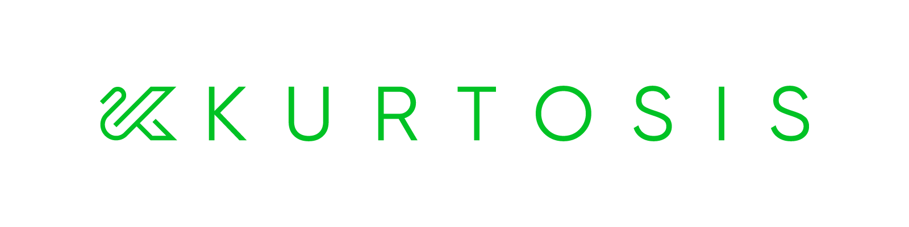
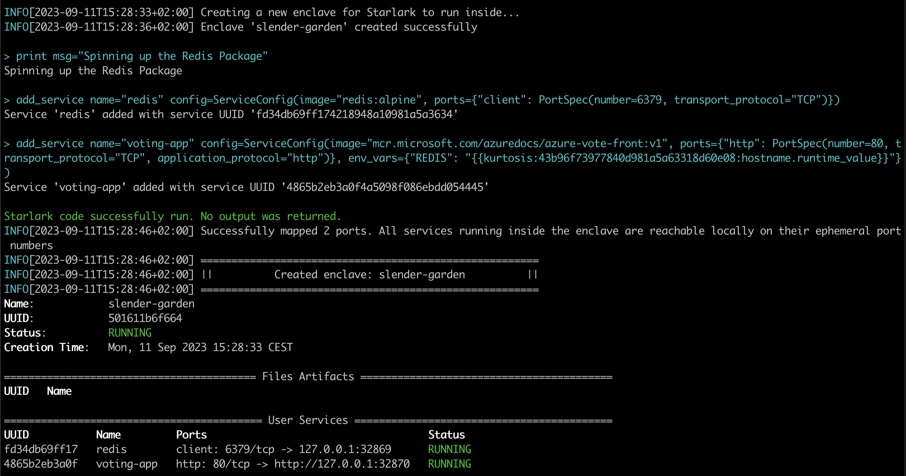
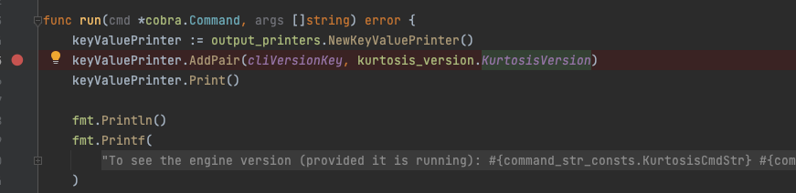
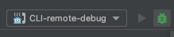
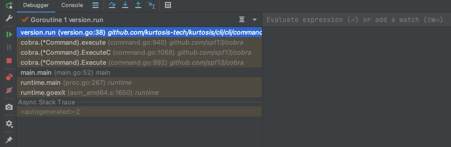
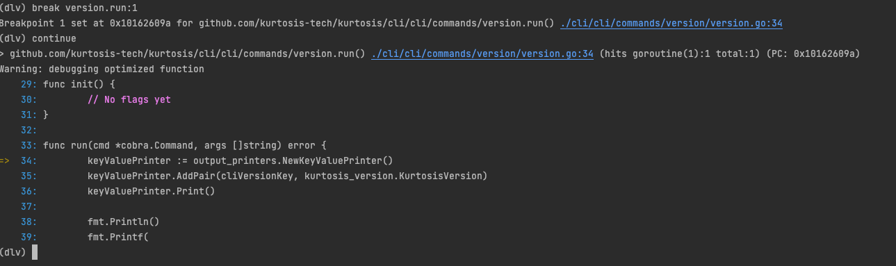
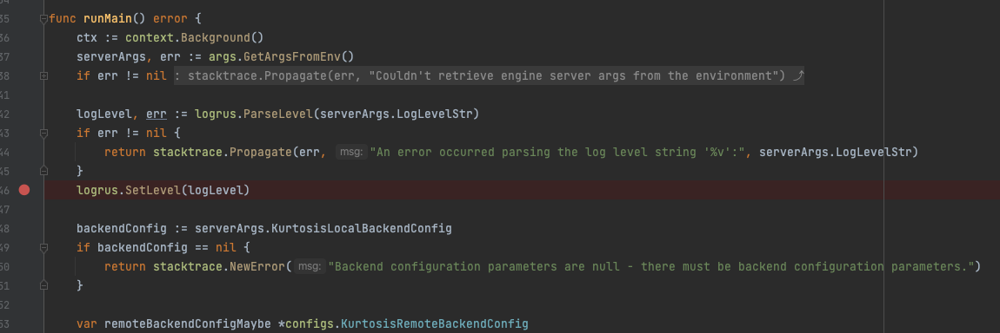
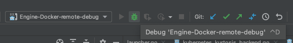
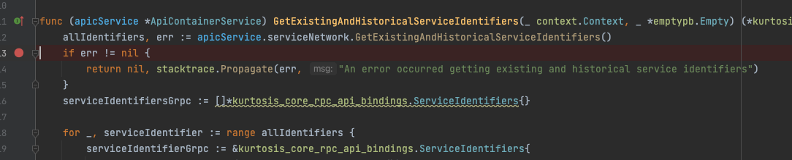
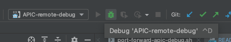

----

What is Kurtosis?
=================
[Kurtosis](https://www.kurtosis.com) is a platform for packaging and launching environments of containerized services ("distributed applications") with a focus on approachability for the average developer. What Docker did for shipping binaries, Kurtosis aims to do even better for distributed applications. 

Kurtosis is formed of:

- A language for declaring a distributed application in Python syntax ([Starlark](https://github.com/google/starlark-go/blob/master/doc/spec.md))
- A packaging system for sharing and reusing distributed application components
- A runtime that makes a Kurtosis app Just Work, independent of whether it's running on Docker or Kubernetes, local or in the cloud
- A set of tools to ease common distributed app development needs (e.g. a log aggregator to ease log-diving, automatic port-forwarding to ease connectivity, a `kurtosis service shell` command to ease container filesystem exploration, etc.)

Why should I use Kurtosis?
==========================
Kurtosis shines when creating, working with, and destroying self-contained distributed application environments. Currently, our users report this to be most useful when:

- You're developing on your application and you need to rapidly iterate on it
- You want to try someone's containerized service or distributed application without setting up an environment, dependencies, etc.
- You want to spin up your distributed application in ephemeral environments as part of your integration tests
- You want to ad-hoc test your application on a big cloud cluster
- You're the author of a containerized service or distributed application and you want to give your users a one-liner to try it
- You want to get an instance of your application running in the cloud without provisioning or administering a Kubernetes cluster

If you're in web3, we have even more specific web3 usecases [here](https://web3.kurtosis.com).

Check out an introductory demo video here:

<video width="630" height="300" src="https://github.com/kurtosis-tech/kurtosis/assets/11703004/f908aa4a-b340-44c8-b948-46993dcdb96e"></video>

How do I get going?
===================
To see Kurtosis in action, first install it using the instructions [here](https://docs.kurtosis.com/install) or visit [Kurtosis Cloud](https://cloud.kurtosis.com/) to provision a remote host.

Then, run the [Redis voting app Kurtosis package](https://github.com/kurtosis-tech/awesome-kurtosis/tree/main/redis-voting-app):

```bash
kurtosis run github.com/kurtosis-tech/awesome-kurtosis/redis-voting-app
```



Finally, open the `http` link printed in the last line in your browser.

If you have an issue or feature request, we'd love to hear about it through one of the following:
- Post your question on our [Github Discussions Forum](https://github.com/kurtosis-tech/kurtosis/discussions/new?category=q-a)
- [Asking for help on our Discord server][discord]
- Filing an issue on our [Github](https://github.com/kurtosis-tech/kurtosis/issues/new/choose) (which can also be done via `kurtosis feedback --bug` or `kurtosis feedback --feature`)
- [Messaging us on Twitter][twitter]

### Going further

To try more Kurtosis packages just like this one, check out the [`awesome-kurtosis` repo][awesome-kurtosis] or one of these packages:

- [Ethereum](https://github.com/kurtosis-tech/ethereum-package): fully functional private Ethereum network in Kurtosis with Flashbots MEV-boost, any EL and CL client combination, and a collection of network monitoring tools.
- [DIVE](https://github.com/HugoByte/DIVE): A CLI + Kurtosis package by [Hugobyte](https://hugobyte.com) for the ICON ecosystem that can spin up EVM, Cosmos, or JVM networks with a bridge between them.
- [NEAR](https://github.com/kurtosis-tech/near-package): A private NEAR network in Kurtosis.

To learn about how to write Kurtosis packages, check out our [quickstart][quickstart-reference].

To read about how Kurtosis works, see [our documentation][docs].

To see where we're going with the product, check out the roadmap [here](https://github.com/kurtosis-tech/kurtosis/wiki/Short%E2%80%90term-Roadmap).

Got more questions? Drop them in our [Github Discussions](https://github.com/kurtosis-tech/kurtosis/discussions/new?category=q-a) where we, or other community members, can help answer.

Why Kurtosis over Compose, Helm, or Terraform?
==============================================
These tools have been around for over a decade, yet most developers still struggle to build distributed applications. Why? In a sentence: building distributed applications is hard, and these tools still haven't made it easy enough for the average developer.

Some of our observations:

- No tool works across the whole software lifecycle: Compose is oriented around quick local environments rather than Prod environments, while Helm and Terraform are the opposite. This often means a dedicated DevOps team handles Prod deployment, leading to the same "throw it across the wall" problem the DevOps movement was founded around.
- Compose, Helm, and Terraform use fully declarative paradigms, making difficult the sequential "first this, then this" logic necessary for many prototyping workflows.
- The inherently declarative nature of all three make [DRY](https://en.wikipedia.org/wiki/Don%27t_repeat_yourself) difficult, leading to frequent copy-pasting.
- All three tend to leave resources hanging around that the developer needs to manually clean up.
- Compose and Helm favor "run it and see what happens" over validation & error-checking, resulting in debugging time and longer dev cycles.
- A significant percentage of developers don't understand how Docker works, and [most don't understand Kubernetes or Terraform][stackoverflow-2022-developer-survey--other-tools].

Here's what our users tell us they like about Kurtosis:

- **It's understandable:** you write code in Python syntax, and you get your distributed application the other side. Variables and functions keep your code DRY.
- **It's portable:** your application runs with a one-liner independent of where you run it. You can build your application on your local Docker, and in seconds get the same thing on your friend's laptop or a Kubernetes cluster in the cloud.
- **It can handle sequential dependencies:** for example, "first generate these files, then use them when starting a service".
- **It's reliable and reproducible:** Kurtosis started as a testing tool and is built to be safe: deterministic execution order, validation to catch errors before runtime, built-in support for inter-service dependencies and readiness checks, etc. Your distributed app should spin up the same way, every time.
- **It abstracts away complexity while being configurable:** instantiating a distributed application is as simple as calling its function with the parameters you want. For example, instantiating a Postgres server with modified username and password:

  On the CLI...
  ```bash
  kurtosis run github.com/kurtosis-tech/postgres-package '{"user": "bobmarley", "password": "buffalosoldier"}'
  ```

  Inside an environment definition...
  ```python
  postgres = import_module("github.com/kurtosis-tech/postgres-package/main.star")

  def run(plan):
    postgres.run(plan, user = "bobmarley", password = "buffalosoldier")
  ```

Contributing to Kurtosis
========================

<details>
<summary>Expand to see contribution info</summary>

See our [CONTRIBUTING](./CONTRIBUTING.md) file.

Repository Structure
--------------------

This repository is structured as a monorepo, containing the following projects:
- `container-engine-lib`: Library used to abstract away container engine being used by the [enclave][enclave].
- `core`: Container launched inside an [enclave][enclave] to coordinate its state
- `engine`: Container launched to coordinate [enclaves][enclave]
- `api`: Defines the API of the Kurtosis platform (`engine` and `core`)
- `cli`: Produces CLI binary, allowing interaction with the Kurtosis system
- `docs`: Documentation that is published to [docs.kurtosis.com](docs)
- `internal_testsuites`: End to end tests

Dev Dependencies (Nix)
----------------

Install the [Nix package manager](https://nixos.org/download).
```bash
sh <(curl -L https://nixos.org/nix/install)
```

And enable some Nix flags (alternatively you can add `--extra-experimental-features 'nix-command flakes'` every time calling the `nix` command):
```bash
mkdir -p ~/.config/nix
echo "experimental-features = nix-command flakes" >> ~/.config/nix/nix.conf
```

And to bring the environment up, just open a new shell terminal, go to the root folder of the repo and run:
```bash
nix  develop
```

This will download all dev deps and setup the environment accordingly.

You can also use the [`direnv`](https://direnv.net/) to automatically load the environment when entering the main folder or using a plugin in your preferred IDE:
- `vscode`: [mkhl.direnv](https://github.com/direnv/direnv-vscode)
- `jet brains`: [Direnv integration](https://plugins.jetbrains.com/plugin/15285-direnv-integration)

Direnv can also be easily installed with Nix (or [HomeBrew](https://formulae.brew.sh/formula/direnv) if you prefer):
```bash
nix-env -f '<nixpkgs>' -iA direnv
```

Now you just to add the direnv hook to your shell:
```bash
echo 'eval "$(direnv hook bash)"' >> ~/.bashrc
# or for ZSH
echo 'eval "$(direnv hook zsh)"' >> ~/.zshrc
```

Now next time you open a new shell terminal and go to repo's folder you environment will update and load automatically.

Dev Dependencies (Manual install)
----------------

The commands below assume that the env variable BREW_PREFIX contains the brew prefix.
```bash
BREW_PREFIX="$(brew --prefix)"
```

#### Bash (5 or above)

On MacOS:
```bash
# Install modern version of bash, the one that ships on MacOS is too old
brew install bash
# Allow bash as shell
echo "${BREW_PREFIX}/bin/bash" | sudo tee -a /etc/shells
# Optional: make bash your default shell
chsh -s "${BREW_PREFIX}/bin/bash"
```

#### Git

On MacOS:
```bash
# Install modern version of git, the one that ships on MacOS can be too old
brew install git
```

#### Docker

On MacOS:
```bash
brew install docker
```

#### Go (1.20 or above)

On MacOS:
```bash
brew install go@1.20
# Add the Go binary dir to your PATH
PATH="${BREW_PREFIX}/opt/go@1.20/bin:$PATH"
# Add the GOPATH bin dir to your PATH
PATH="${HOME}/go/bin:$PATH"
```

On Ubuntu:
```bash
wget https://go.dev/dl/go1.20.8.linux-amd64.tar.gz
tar -C /usr/local -zxf go1.20.8.linux-amd64.tar.gz
# Add the following to your bashrc or equivalent.
export PATH=$PATH:/usr/local/go/bin
```

#### Goreleaser

On MacOS:
```bash
brew install goreleaser/tap/goreleaser
```

On Ubuntu:
```bash
echo 'deb [trusted=yes] https://repo.goreleaser.com/apt/ /' | sudo tee /etc/apt/sources.list.d/goreleaser.list
sudo apt update
sudo apt install goreleaser
```

#### Node (20.* or above) and Yarn

On MacOS, using `NVM`:
```bash
brew install nvm
mkdir ~/.nvm
nvm install 20.11.0
npm install -g yarn
```

On Ubuntu, using `NVM`:
```bash
curl https://raw.githubusercontent.com/creationix/nvm/master/install.sh | bash
source ~/.bashrc
nvm install 20.11.0
npm install -g yarn
```

#### Rust

On MacOS, Ubuntu:
```bash
curl --proto '=https' --tlsv1.2 -sSf https://sh.rustup.rs | sh
```

#### Go and Typescript protobuf compiler binaries

On MacOS:
```bash
brew install protoc-gen-go
brew install protoc-gen-go-grpc
go install connectrpc.com/connect/cmd/protoc-gen-connect-go@latest
yarn global add ts-protoc-gen
yarn global add grpc-tools
```

On Ubuntu:
```bash
go install google.golang.org/grpc/cmd/protoc-gen-go@latest
go install google.golang.org/grpc/cmd/protoc-gen-go-grpc@latest
go install connectrpc.com/connect/cmd/protoc-gen-connect-go@latest
yarn global add ts-protoc-gen
yarn global add grpc-tools
```

#### OpenAPI generators for Go and Typescript

On MacOS:
```bash
go install github.com/deepmap/oapi-codegen/cmd/oapi-codegen@v1.16.2
yarn global add openapi-typescript@7.0.0-next.5
```

On Ubuntu:
```bash
go install github.com/deepmap/oapi-codegen/cmd/oapi-codegen@v1.16.2
yarn global add openapi-typescript@7.0.0-next.5
```

Build Instructions
------------------

To build the entire project, run:

```bash
./scripts/build.sh
```

To only build a specific project, run the script on `./PROJECT/PATH/script/build.sh`, for example:

```bash
./container-engine-lib/scripts/build.sh
./core/scripts/build.sh
./api/scripts/build.sh
./engine/scripts/build.sh
./cli/scripts/build.sh
```

If there are any changes to the Protobuf files in the `api` subdirectory, the Protobuf bindings must be regenerated:

```bash
./api/scripts/regenerate-protobuf-bindings.sh
```

Build scripts also run unit tests as part of the build process.

Unit Test Instructions
----------------------

For all Go modules, run `go test ./...` on the module folder. For example:

```bash
cd cli/cli/
go test ./...
```

E2E Test Instructions
---------------------

Each project's build script also runs the unit tests inside the project. Running `./script/build.sh` will guarantee that all unit tests in the monorepo pass.

To run the end-to-end tests:

1. Make sure Docker is running

```console
$ docker --version
Docker version X.Y.Z
```

2. Make sure Kurtosis Engine is running

```console
$ kurtosis engine status
A Kurtosis engine is running with the following info:
Version:   0.X.Y
```

3. Run `test.sh` script

```console
$ ./internal_testsuites/scripts/test.sh
```

If you are developing the Typescript test, make sure that you have first built `api/typescript`. Any
changes made to the Typescript package within `api/typescript` aren't hot loaded as of 2022-09-29.

Dev Run Instructions
--------------------

Once the project has built, run `./cli/cli/scripts/launch-cli.sh` as if it was the `kurtosis` command:

```bash
./cli/cli/scripts/launch-cli.sh enclave add
```

If you want tab completion on the recently built CLI, you can alias it to `kurtosis`:

```bash
alias kurtosis="$(pwd)/cli/cli/scripts/launch-cli.sh"
kurtosis enclave add
```

Run Debug Instructions (for Golang code so far)
----------------------------------------------

For running CLI with Golang remote debug:

1. Build the CLI dev binary and run the command you want to debug (kurtosis version in this example), this will start the debug server and will wait for a client connection
```bash
cli/cli/scripts/build.sh
source ./scripts/set_kt_alias.sh
ktdebug version
```
2. Open the command's file you want to debug
3. Add the breakpoint in the line where you want to stop the cursor

4. Then choose the "CLI-remote-debug" run configuration in the "run panel"
5. Press the "debug" button

6. Use the debug panel to inspect the variables value and continue with the debug flow



For running CLI with Delve debug client:

1. Build the CLI dev binary and run the command you want to debug (kurtosis version in this example), but first pass "dlv-terminal" as the first argument (this will start the Delve client in the terminal)
```bash
cli/cli/scripts/build.sh
source ./scripts/set_kt_alias.sh
ktdebug dlv-terminal version
```
2. You can add a new breakpoint using the terminal client and the `break` command
```bash
(dlv) break version.run:1
```
3. You can move the cursor to the breakpoint created in the previous step with the `continue` command
```bash
(dlv) continue
```

4. You can see [more Delve commands here][delve-docs]


For running Kurtosis engine with Golang remote debug:

1. Run the main build script with the first argument `debug_mode` as true. This will generate a new Kurtosis engine container image which will contain the `debug` suffix in the name.
```bash
scripts/build.sh true 
```
2. Add the breakpoint in the line where you want to stop the cursor
   
3. Run the engine in debug mode with the `ktdev engine start --debug-mode` or the `ktdev engine restart --debug-mode` commands
```bash
source ./scripts/set_kt_alias.sh
ktdev engine start --debug-mode 
```
4. Then choose the "Engine-remote-debug" run configuration in the "run panel"
5. Press the "debug" button
   
6. Make a call to the engine's server (you can use the Kurtosis CLI or Postman) in order to reach out the breakpoint in the code
7. Use the debug panel to inspect the variables value and continue with the debug flow
   
8. You can debug the CLI and the Kurtosis engine's server at the same time by running it with `ktdebug` instead of `ktdev` mentioned in a previous step, remember to run both remote debug configurations in the Goland IDE.
```bash
source ./scripts/set_kt_alias.sh
ktdebug engine start
```

Additional steps if you are debugging Kurtosis engine in K8s:

1. Upload the engine's image for debug to the K8s cluster
```bash
# for example:
k3d image load kurtosistech/engine:5ec6eb-dirty-debug
```
2. Run the port-forward script before pressing the debug button in Golang (in another terminal instance) to bind the host's port to the container's debug server port
```bash
scripts/port-forward-engine-debug.sh
```
3. Do not forget to run the Kurtosis gateway after calling the engine's server (in another terminal instance also)
```bash
ktdev gateway
```

For running Kurtosis APIC with Golang remote debug:
1. Run the main build script with the first argument `debug_mode` as true. This will generate a new Kurtosis APIC container image which will contain the `debug` suffix in the name.
```bash
scripts/build.sh true 
```
2. Add the breakpoint in the line where you want to stop the cursor.
   
3. Run the Kurtosis engine in debug more or not depending on if you want to also debug the engine.
```bash
source ./scripts/set_kt_alias.sh
ktdev engine start --debug-mode

OR

ktdev engine start # you will have to build the engine in the regular way `engine/scripts/build.sh` if you choose this version
```
4. Add a new enclave in debug mode with the `enclave add` command and passing the `debug-mode` flag. This will create a new APIC container with the debug server port bounded and waiting for a connection.
IMPORTANT: You can only run one enclave in debug mode so far, if you want to run another one it will fail due the debug port is already in use, 
```bash
ktdev enclave add --debug-mode 
```
5. Then choose the "APIC-remote-debug" run configuration in the "run panel"
6. Press the "debug" button
   
7. Find the APIC's GRPC server port in the host machine (you can check it in Docker Desktop or using the Docker CLI, it's the one bounded with the container's 7443 port)
8. Make a call to the APIC's server (you can use the Kurtosis CLI or Postman) in order to reach out the breakpoint in the code
9. Use the debug panel to inspect the variables value and continue with the debug flow
   
10. You can debug the CLI, the Kurtosis engine's server and the Kurtosis APIC's server at the same time by running it with `ktdebug` instead of `ktdev` mentioned in a previous step, remember to run the three remote debug configurations in the Goland IDE.
```bash
source ./scripts/set_kt_alias.sh
ktdev engine start --debug-mode
ktdebug enclave add
```

Additional steps if you are debugging Kurtosis engine in K8s:

1. Upload the APIC's image for debug to the K8s cluster
```bash
# for example:
k3d image load kurtosistech/core:5ec6eb-dirty-debug
```
2. Run the port-forward script before pressing the debug button in Golang (in another terminal instance) to bind the host's port to the container's debug server port
```bash
scripts/port-forward-apic-debug.sh enclave-name
```
3. Do not forget to run the Kurtosis gateway after calling the APIC's server (in another terminal instance also)
```bash
ktdev gateway
```

</details>

<!-------- ONLY LINKS BELOW THIS POINT -------->
[enclave]: https://docs.kurtosis.com/advanced-concepts/enclaves
[awesome-kurtosis]: https://github.com/kurtosis-tech/awesome-kurtosis#readme
[quickstart-reference]: https://docs.kurtosis.com/quickstart
[discord]: https://discord.gg/6Jjp9c89z9
[kurtosis-tech]: https://github.com/kurtosis-tech
[docs]: https://docs.kurtosis.com
[twitter]: https://twitter.com/KurtosisTech
[starlark-explanation]: https://docs.kurtosis.com/explanations/starlark
[stackoverflow-2022-developer-survey--other-tools]: https://survey.stackoverflow.co/2022/#most-popular-technologies-tools-tech-prof
[delve-docs]: https://github.com/go-delve/delve/blob/master/Documentation/cli/README.md
