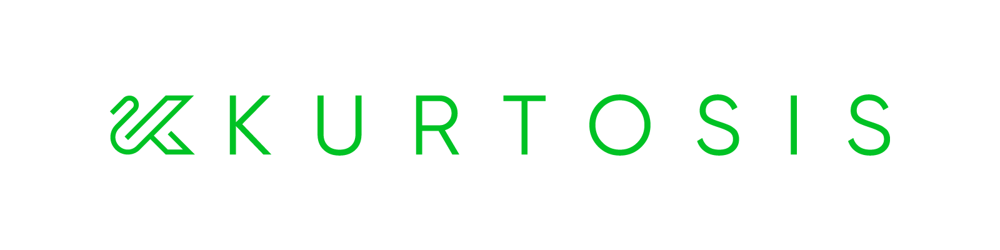

----
## What is Kurtosis?
[Kurtosis](https://www.kurtosis.com) is a composable build system for multi-container test environments. Kurtosis makes it easier for developers to set up test environments that require dynamic setup logic (e.g. passing IPs or runtime-generated data between services) or programmatic data seeding.

## Why Kurtosis?

Developers usually set up these types of dynamic environments with a free-form scripting language like bash or Python, interacting with the Docker CLI or Docker Compose. Kurtosis is designed to make these setups easier to maintain and reuse in different test scenarios.

In Kurtosis, test environments have these properties:
- Environment-level portability: the entire test environment always runs the same way, regardless of the host machine
- Composability: environments can be composed and connected together without needing to know the inner details of each setup
- Parameterizability: environments can be parameterized, so that they're easy to modify for use across different test scenarios

## Architecture

#### Kurtosis has a definition language with:
- An instruction set of useful primitives for setting up and manipulating environments
- A scriptable Python-like SDK in Starlark, a build language used by Google’s Bazel
- A package management system for shareability and composability

#### Kurtosis has a validator with:
- Compile-time safety to quickly catch errors in test environment definitions
- The ability to dry-run test environment definitions to verify what will be run, before running

#### Kurtosis has a runtime to:
- Run multi-container test environments over Docker or Kubernetes, depending on how you wish to scale
- Enable debugging and investigation of problems live, as they're happening in your test environment
- Manage file dependencies to ensure complete portability of test environments across different test runs and backends

Read more about Kurtosis on our [website](https://www.kurtosis.com/) and in our [docs][docs].
---
## To start using Kurtosis

### Prerequisites

#### Install and start Docker

Docker must be installed and running on your machine:

```bash
docker version
```

If it's not, follow the instructions from the [Docker docs](https://docs.docker.com/get-docker/).

#### Install the Kurtosis CLI

##### On MacOS:

```bash
brew install kurtosis-tech/tap/kurtosis-cli
```
For other installations methods, visit these [install instructions](https://docs.kurtosis.com/install#ii-install-the-cli).

### Running Kurtosis
Kurtosis can be used to create ephemeral environments called [enclaves][enclave]. We'll create a simple [Starlark][starlark-explanations] script to specify what we want our enclave to look like and what it will contain. Let's write one that spins up multiple replicas of `httpd`:

```python
cat > script.star << EOF
def run(plan, args):
    configs = {}
    for i in range(args.replica_count):
       plan.add_service(
          "httpd-replica-"+str(i),
          config = ServiceConfig(
              image = "httpd",
              ports = {
                  "http": PortSpec(number = 8080),
              },
          ),
      )
EOF
```

Running the following will give us an enclave with three services:

```bash
kurtosis run script.star '{"replica_count": 3}'
```
```console
INFO[2023-03-22T13:27:03+01:00] Creating a new enclave for Starlark to run inside...
INFO[2023-03-22T13:27:07+01:00] Enclave 'arid-delta' created successfully

> add_service service_name="httpd-replica-0" config=ServiceConfig(image="httpd", ports={"http": PortSpec(number=8080)})
Service 'httpd-replica-0' added with service UUID '80030157c58f4eb2b9c98f41dd938ed0'

> add_service service_name="httpd-replica-1" config=ServiceConfig(image="httpd", ports={"http": PortSpec(number=8080)})
Service 'httpd-replica-1' added with service UUID '4abff039bfa74b019f0a0d2e155c760a'

> add_service service_name="httpd-replica-2" config=ServiceConfig(image="httpd", ports={"http": PortSpec(number=8080)})
Service 'httpd-replica-2' added with service UUID 'b6f90bc6dad748a4807ad4fbc3e5cc9a'

Starlark code successfully run. No output was returned.
INFO[2023-03-22T13:27:37+01:00] ===================================================
INFO[2023-03-22T13:27:37+01:00] ||          Created enclave: arid-delta          ||
INFO[2023-03-22T13:27:37+01:00] ===================================================
Name:            arid-delta
UUID:            0b3879d30c80
Status:          RUNNING
Creation Time:   Wed, 22 Mar 2023 13:27:03 CET

========================================= Files Artifacts =========================================
UUID   Name

========================================== User Services ==========================================
UUID           Name              Ports                               Status
80030157c58f   httpd-replica-0   http: 8080/tcp -> 127.0.0.1:54164   RUNNING
4abff039bfa7   httpd-replica-1   http: 8080/tcp -> 127.0.0.1:54170   RUNNING
b6f90bc6dad7   httpd-replica-2   http: 8080/tcp -> 127.0.0.1:54174   RUNNING
```
To see a more in-depth example and explanation of Kurtosis' capabillities, visit our [quickstart][quickstart-reference].

### More examples

Further examples can be found in our [`awesome-kurtosis` repo][awesome-kurtosis].

## To start contributing to Kurtosis

See our [CONTRIBUTING](./CONTRIBUTING.md) file.

--- 

## Repository Structure

This repository is structured as a monorepo, containing the following projects:
- `container-engine-lib`: Library used to abstract away container engine being used by the [enclave][enclave].
- `core`: Container launched inside an [enclave][enclave] to coordinate its state
- `engine`: Container launched to coordinate [enclaves][enclave]
- `api`: Defines the API of the Kurtosis platform (`engine` and `core`)
- `cli`: Produces CLI binary, allowing iteraction with the Kurtosis system
- `docs`: Documentation that is published to [docs.kurtosis.com](docs)
- `internal_testsuites`: End to end tests

## Dependencies

To build Kurtosis, you must the following dependencies installed:

- Bash (5 or above) + Git

On MacOS:
```bash
# Install modern version of bash, the one that ships on MacOS is too old
brew install bash
# Allow it as shell
echo "${BREW_PREFIX}/bin/bash" | sudo tee -a /etc/shells
# Optional: make bash your default shell
chsh -s "${BREW_PREFIX}/bin/bash"
# Install modern version of git, the one that ships on MacOS is too old
brew install git
```
- Docker
  
On MacOS:
```bash
brew install docker
```

- Go (1.18 or above)

On MacOS:
```bash
brew install go@1.18
```

- Goreleaser

On MacOS:
```bash
brew install goreleaser/tap/goreleaser
```

- Node (16.14 or above) and Yarn

On MacOS, using `NVM`:
```bash
brew install nvm
mkdir ~/.nvm
nvm install 16.14.0
npm install -g yarn
```
- Go and Typescript protobuf compiler binaries

On MacOS:
```bash
brew install protoc-gen-go
brew install protoc-gen-go-grpc
brew install protoc-gen-grpc-web
npm install -g ts-protoc-gen
npm install -g grpc-tools
```
- Musl

On MacOS:
```bash
brew install filosottile/musl-cross/musl-cross
```

## Unit Test Instructions

For all Go modules, run `go test ./...` on the module folder. For example:

```console
$ cd cli/cli/
$ go test ./...
```

## Build Instructions

To build the entire project, run:

```console
$ ./script/build.sh
```

To only build a specific project, run the script on `./PROJECT/PATH/script/build.sh`, for example:

```console
$ ./container-engine-lib/build.sh
$ ./core/scripts/build.sh
$ ./api/scripts/build.sh
$ ./engine/scripts/build.sh
$ ./cli/scripts/build.sh
```

If there are any changes to Protobuf files in `api`, the bindings must be regenerated:

```console
$ ./api/scripts/regenerate-protobuf-bindings.sh
```

Build scripts also run unit tests as part of the build proccess

## E2E Test Instructions

Each project's build script also runs the unit tests inside the project. Running `./script/build.sh` will guarantee that all unit tests in the monorepo pass.

To run the end to end tests:

1. Make sure Docker is running
```console
$ docker --version
Docker version X.Y.Z
```

2. Make sure Kurtosis Engine is running
```console
$ kurtosis engine status
A Kurtosis engine is running with the following info:
Version:   0.X.Y
```

1. Run `test.sh` script
```console
$ ./internal_testsuites/scripts/test.sh
```

If you are developing the Typescript test, make sure that you have first built `api/typescript`. Any
changes made to the Typescript package within `api/typescript` aren't hot loaded as of 2022-09-29.

## Run Instructions

To interact with the built CLI, run `./cli/cli/scripts/launch_cli.sh` as if it was the `kurtosis` command:

```console
$ ./cli/cli/scripts/launch_cli.sh enclave add
```

If you want tab completion on the recently built CLI, you can alias it to `kurtosis`:

```console
$ alias kurtosis="$(pwd)/cli/cli/scripts/launch_cli.sh"
$ kurtosis enclave add
```

## Community and support

Kurtosis is a free and source-available product maintained by the [Kurtosis][kurtosis-tech] team. We'd love to hear from you and help where we can. You can engage with our team and our community in the following ways:
- Filing an issue in our [Github](https://github.com/kurtosis-tech/kurtosis/issues/new/choose)
- Joining our [Discord][discord] server
- Following us on [Twitter][twitter]
- [Emailing us](mailto:feedback@kurtosistech.com)
- [Hop on a call to chat with us](https://calendly.com/d/zgt-f2c-66p/kurtosis-onboarding)

<!-------- ONLY LINKS BELOW THIS POINT -------->
[enclave]: https://docs.kurtosis.com/explanations/architecture#enclaves
[awesome-kurtosis]: https://github.com/kurtosis-tech/awesome-kurtosis#readme
[quickstart-reference]: https://docs.kurtosis.com/quickstart
[discord]: https://discord.gg/Es7QHbY4
[kurtosis-tech]: https://github.com/kurtosis-tech
[docs]: https://docs.kurtosis.com
[twitter]: https://twitter.com/KurtosisTech
[starlark-explanation]: https://docs.kurtosis.com/explanations/starlark
