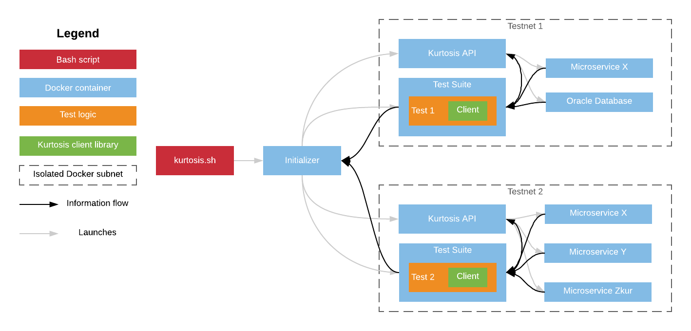

Kurtosis Architecture
=====================
Background
----------
Every test in existence goes through four phases:

1. Setup
2. Perturbation
3. Validation
4. Teardown

In unit testing, this usually looks like:

1. Instantiate the object to test and mock all surrounding objects
2. Execute the functions being tested
3. Assert the expected result
4. Garbage collect all objects

Engineers have well-established unit-testing tools for each phase, so developers write many.

When the component being tested is the entire distributed system however, things become seriously difficult: where do we run the test nodes? How do we initialize their config & data files? Where do we run the test logic, and how does it talk to the system? How do we ensure the network is cleaned up after the test is done?

These are challenging questions, and in our experience teams tend to go one of two ways: write their own automation framework from scratch, or skip sandboxed networks altogether and run a single long-lived testnet that everyone uses. The latter is error-prone and costly to maintain while the former is bespoke and costly to write. Ideally, teams would have a platform that automates the heavy lifting of each phase so they can focus on writing tests. This is Kurtosis.

Architecture
------------
To see how Kurtosis resolves the distributed system testing challenges, here's an example diagram of a Kurtosis testsuite for Microservice X that contains two tests:

This architecture has the following components:

* **Testnet:** The network of services being tested (one per test)
* **Service:** A Dockerized service forming part of a testnet
* **Initializer:** The Docker container "CLI" that serves as the entrypoint for running Kurtosis
* **Kurtosis API:** The Docker sidecar container (one per test) that handles initializing, manipulating, and tearing down testnets
* **Testsuite:** The Docker container (one per test) that holds the user's custom logic for starting the custom services forming the networks being tested, as well as the logic for the tests to run
* **Kurtosis Client:** A library in the user's language of choice that abstracts away communication with the Kurtosis API for testnet initialization, manipulation, and teardown

The test phases proceed in the following order:

1. **Setup:**
    1. The initializer creates a new Docker subnet to contain the Kurtosis API container, testsuite container, and testnet services
    1. The API container and testsuite containers are launched
    1. As part of launch, the Kurtosis client library instructs the API container what the testnet looks like
    1. The API container instantiates the testnet as instructed
1. **Perturbation:** The test, running inside the testsuite container, makes calls against the network
1. **Validation:** The test asserts the expected responses
1. **Teardown:**
    1. The test completes and reports its status back to the initializer
    1. The API container stops the testnet containers
    1. The API container and testsuite container exit
    1. The initializer tears down the Docker subnet created for the test

Key features:

* Testnet services run in Docker containers, so any Dockerized service can be used in a testnet (e.g. Test 1 in the diagram above uses an Oracle database alongside Microservice X)
* Each test receives its own independent testnet running in an isolated Docker subnet, so tests are consistently repeatable and don't interfere with each other
* Testsuites run as Docker containers, so developers can write tests in any language they please
* The Kurtosis client library and API container automate the gruntwork of network setup, manipulation, and teardown so tests are easy to write

Next Steps
----------
From here, you can:

* Visit [the quickstart instructions](./quickstart.md) to get started writing your own Kurtosis test suite
* Head over to the [the testsuite deep dive](./testsuite-details.md) to learn more about what's in a testsuite and how to customize it
* Check out [the CI documentation](./running-in-ci.md) to see how Kurtosis runs inside of CI
* Pop into [the Kurtosis Discord](https://discord.gg/6Jjp9c89z9) to join the community!
