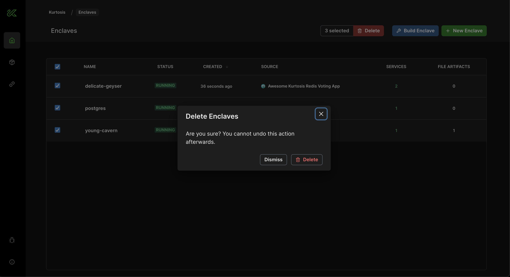
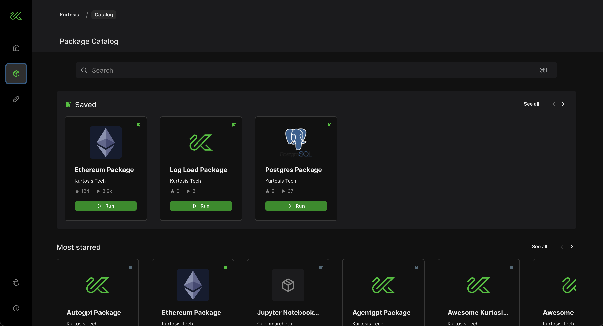
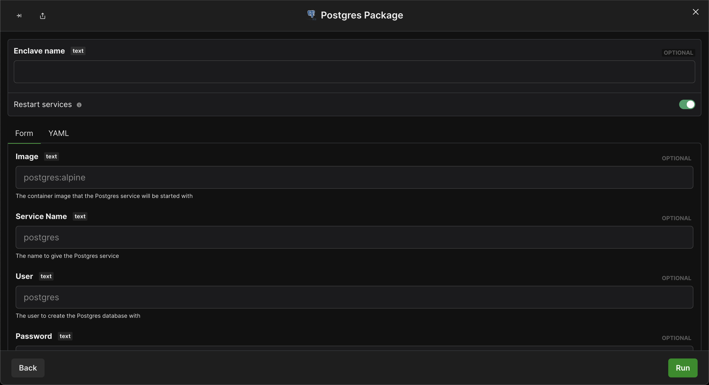
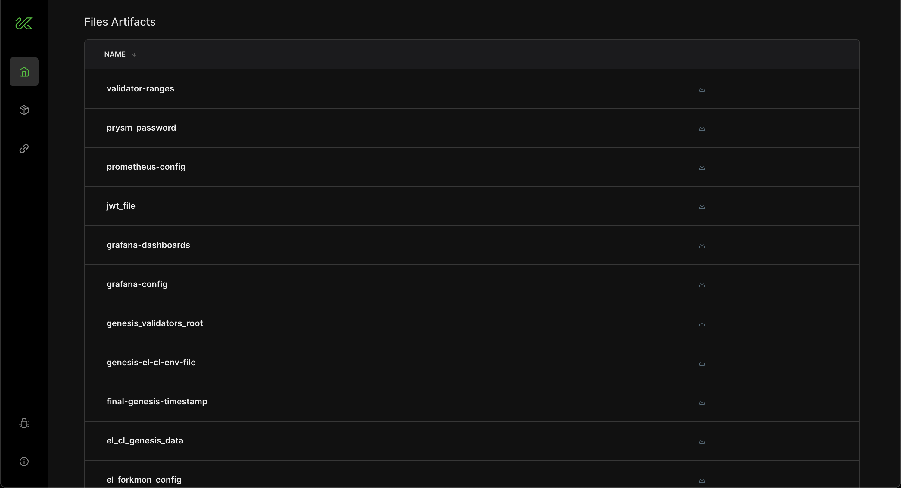
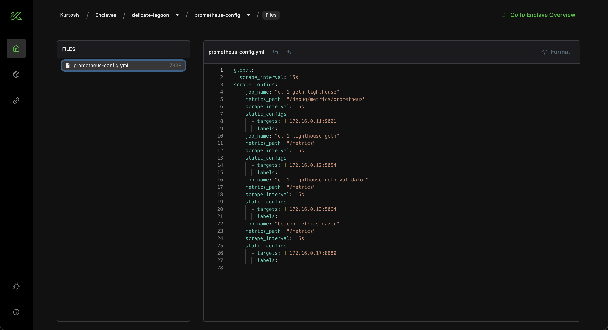

Enclave
-----------
An enclave is a logical grouping concept, a "walled garden" in which Kurtosis runs a microservice stack. Each Kurtosis instance can have many enclaves, and each enclave is isolated so that port and file conflicts don't occur. The enclaves and the services inside of them get mapped down into Docker or Kubernetes concepts, depending on your backend.

_Multiple enclaves can run on a single Kurtosis instance._

Enclaves are cheap to create and cheap to destroy. They won't leave any resources hanging around after deletion.

_Deleting enclaves is easy._

Package
-----------
A package contains the setup logic for a microservice stack, and serves as a distribution mechanism.

_Many packages are already available on the [Package Catalog](https://catalog.kurtosis.com/)._

Packages can be composed together to form new microservices stacks, which can themselves be distributed as packages.

Each package is identified by a "locator", which is a URL-like string uniquely identifying the package. For example, `github.com/kurtosis-tech/postgres-package`.

Packages can can be configured using parameters, which allows package consumers to flex their microservice stack without knowing the inner workings of the stack.

_Kurtosis provides tooling for authors to document their package parameters._

Files Artifact
-----------
A files artifact is a set of files shipped with, or generated by, a package. Files artifacts are typically used for rendering configuration files that must be dynamically generated when an environment spins up, or for shipping static configuration files that must be shared across multiple services. 

When you run a package, you can see the files artifacts that the package created in the enclave.

_Several files artifacts in an enclave._

Files artifacts are just `.tgz` files, so exploring their contents is easy.

_Contents of a files artifact called `prometheus-config`._
