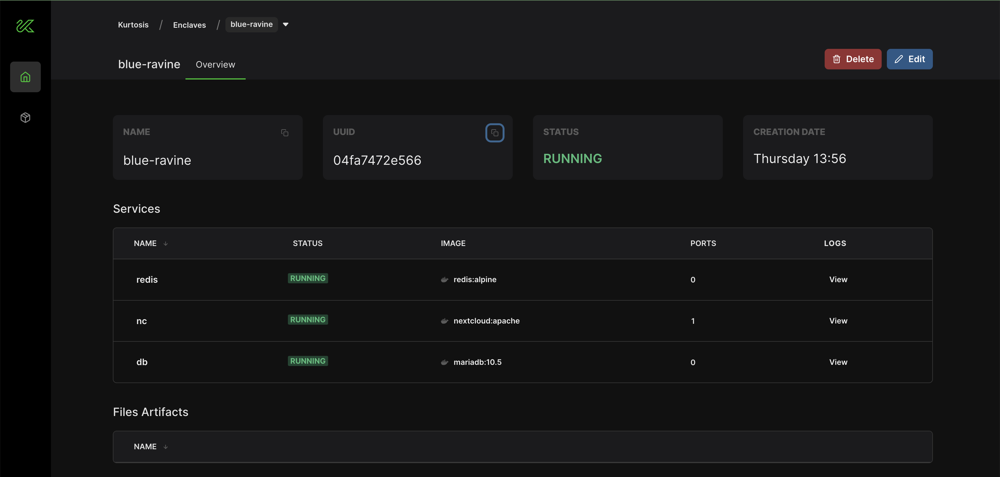

This guide assumes that you have [Kurtosis installed](../get-started/installing-the-cli.md) and a project with a `docker-compose.yml`, `compose.yml`, `docker_compose.yml` or `.yaml` equivalents.

:::info Experimental Feature
This is an experimental feature still under development and some Docker Compose setups are not yet supported. 
See below for list of features not yet supported in Kurtosis. If you'd like support for your Docker Compose setup, let us know at our [Github](https://github.com/kurtosis-tech/kurtosis/issues)!
:::

### 1. Setup Docker Compose project

Navigate to the root of your project with a `docker-compose.yml` or if the project is hosted on Github, grab the Github link where the Docker Compose exists. For this guide, we'll go off of the [`nextcloud-redis-mariadb`](https://github.com/docker/awesome-compose/blob/master/nextcloud-redis-mariadb/compose.yaml) compose in the [`awesome-compose`](https://github.com/docker/awesome-compose/tree/master) repo.

```
services:
  nc:
    image: nextcloud:apache
    restart: always
    ports:
      - 80:80
    volumes:
      - nc_data:/var/www/html
    networks:
      - redisnet
      - dbnet
    environment:
      - REDIS_HOST=redis
      - MYSQL_HOST=db
      - MYSQL_DATABASE=nextcloud
      - MYSQL_USER=nextcloud
      - MYSQL_PASSWORD=nextcloud
  redis:
    image: redis:alpine
    restart: always
    networks:
      - redisnet
    expose:
      - 6379
  db:
    image: mariadb:10.5
    command: --transaction-isolation=READ-COMMITTED --binlog-format=ROW
    restart: always
    volumes:
      - db_data:/var/lib/mysql
    networks:
      - dbnet
    environment:
      - MYSQL_DATABASE=nextcloud
      - MYSQL_USER=nextcloud
      - MYSQL_ROOT_PASSWORD=nextcloud
      - MYSQL_PASSWORD=nextcloud
    expose:
      - 3306
volumes:
  db_data:
  nc_data:
networks:
  dbnet:
  redisnet:
```

### 2. Run!

In the root of your project, run the following command:

```
kurtosis run .
```
OR using github link:
```
kurtosis run github.com/awesome-compose/nextcloud-redis-mariadb
```

Behind the scenes, Kurtosis will interpret your Docker Compose setup as a Kurtosis [package](../get-started/basic-concepts.md#package) and convert it into [starlark](../advanced-concepts/starlark.md) that is executed on an [enclave](../get-started/basic-concepts.md#enclave). The output will look like this:

```bash
INFO[2024-01-25T13:56:29-05:00] Creating a new enclave for Starlark to run inside...
INFO[2024-01-25T13:56:33-05:00] Enclave 'blue-ravine' created successfully

Container images used in this run:
> nextcloud:apache - locally cached
> mariadb:10.5 - locally cached
> redis:alpine - locally cached

> add_service name="db" config=ServiceConfig(image="mariadb:10.5", files={"/var/lib/mysql": Directory(persistent_key="db--volume0")}, cmd=["--transaction-isolation=READ-COMMITTED", "--binlog-format=ROW"], env_vars={"MYSQL_DATABASE": "nextcloud", "MYSQL_PASSWORD": "nextcloud", "MYSQL_ROOT_PASSWORD": "nextcloud", "MYSQL_USER": "nextcloud"})
Service 'db' added with service UUID '7010d01344e34a7c9f061d4fa43e5e0d'

> add_service name="nc" config=ServiceConfig(image="nextcloud:apache", ports={"port0": PortSpec(number=80, transport_protocol="TCP")}, files={"/var/www/html": Directory(persistent_key="nc--volume0")}, env_vars={"MYSQL_DATABASE": "nextcloud", "MYSQL_HOST": "db", "MYSQL_PASSWORD": "nextcloud", "MYSQL_USER": "nextcloud", "REDIS_HOST": "redis"})
Service 'nc' added with service UUID 'c30843ea60b8459c8841565a11be5dde'

> add_service name="redis" config=ServiceConfig(image="redis:alpine", env_vars={})
Service 'redis' added with service UUID '26dceba158004fdcb8d5dba035a6c4dd'

Starlark code successfully run. No output was returned.

Made with Kurtosis - https://kurtosis.com
INFO[2024-01-25T13:56:46-05:00] ====================================================
INFO[2024-01-25T13:56:46-05:00] ||          Created enclave: blue-ravine          ||
INFO[2024-01-25T13:56:46-05:00] ====================================================
Name:            blue-ravine
UUID:            04fa7472e566
Status:          RUNNING
Creation Time:   Thu, 25 Jan 2024 13:56:29 EST
Flags:

========================================= Files Artifacts =========================================
UUID   Name

========================================== User Services ==========================================
UUID           Name    Ports                              Status
7010d01344e3   db      <none>                             RUNNING
c30843ea60b8   nc      port0: 80/tcp -> 127.0.0.1:62938   RUNNING
26dceba15800   redis   <none>                             RUNNING
```

Congrats! You now have your Docker Compose setup running in Kurtosis. Now, run `kurtosis web` to view your environment in Kurtosis' GUI!



### Notes on Docker Compose to Kurtosis conversion

#TODO(tedi)

### Docker Compose features not supported

#TODO(tedi)