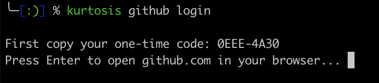
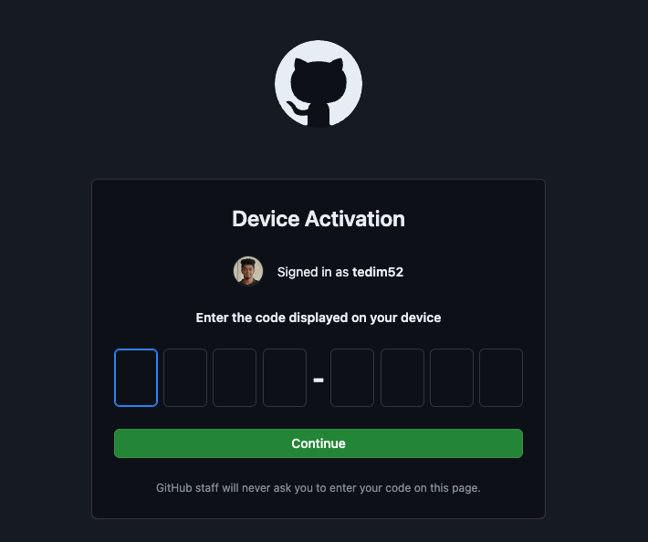
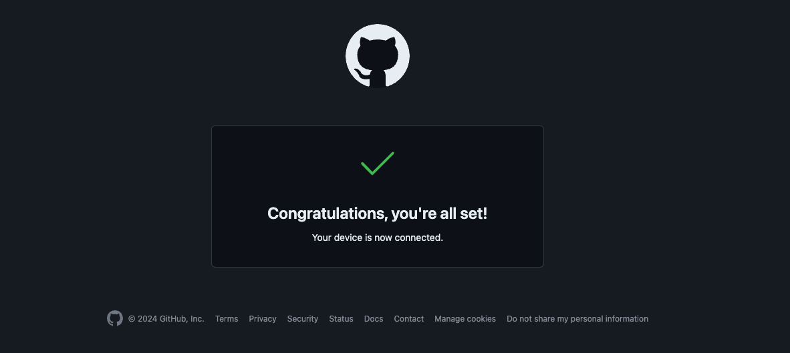
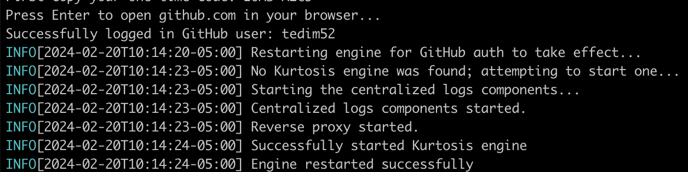

Kurtosis CLI supports the ability to run private packages hosted on GitHub via `kurtosis github login`. This guide assumes that you have [Kurtosis installed](../get-started/installing-the-cli.md) and a package hosted GitHub that is private.

:::note
GitHub Login is not yet supported over Kubernetes backend. Please create an [issue](https://github.com/kurtosis-tech/kurtosis/issues) to request this feature!
:::

### 1. Authorize Kurtosis CLI OAuth Application

Using Kurtosis CLI, run:
```bash
kurtosis github login
```

The following prompt should be displayed. After copying the one time code, press enter.



A GitHub screen should pop up in your browser instructing you to enter the one-time code you just copied in your terminal. 



After entering the code, GitHub will prompt you to authorize Kurtosis CLI. Kurtosis CLI requests [`repo`](https://docs.github.com/en/apps/oauth-apps/building-oauth-apps/scopes-for-oauth-apps#available-scopes) access to repositories for the ability to read and pull from private repositories.

:::info OAuth Token Scopes
While `repo` gives Kurtosis read and write access to private repositories, Kurtosis only performs read operations. GitHub does not support a `[repo:read`](https://github.com/jollygoodcode/jollygoodcode.github.io/issues/6) OAuth scope, but an alternative is to use [fine-grained personal access tokens](https://docs.github.com/en/authentication/keeping-your-account-and-data-secure/managing-your-personal-access-tokens#fine-grained-personal-access-tokens) to restrict Kurtosis CLI read/write and repository permissions. This token can be passed to Kurtosis CLI via the [`kurtosis engine start --github-auth-token=<>`](../cli-reference/engine-start.md) flag.
:::

:::note Private Packages within GitHub Orgs
If the private package you'd like to develop on lives in a GitHub org, the organization must also authorize Kurtosis CLI. To have an organization you are a part of authorize Kurtosis CLI, click the `Request` button next to the organization name on the authorization page, then notify your org admins to accept the request via email.
:::


Once you have authorized Kurtosis CLI, you'll be redirected to a success page.



Now, navigate back to your terminal. Your Kurtosis engine will automatically restart for GitHub auth to take effect.




:::info OAuth Token storage
Behind the scenes, authorizing Kurtosis CLI means GitHub will generate an OAuth token that Kurtosis CLI can use to perform GitHub operations on your behalf. Following GitHub CLI, we attempt to securely store this token in system credential storage. If system credential store is unavailable, we store it in a plain text file in your Kurtosis config directory at `kurtosis config path`.
:::

### Run a Private Package

Now, run a private package! Get the locator of the private package you have access to that you'd like to run that. For this example, we'll assume there's a private package at `github.com/tedim52/my-private-package`
```
kurtosis run github.com/private-author/my-private-package
```

Now, the package should run! Additionally, any [locators](../advanced-concepts/locators.md)  (e.g. in `upload_files` or `import_module`) that refer to resources in private GitHub repositories you have access to, are also authorized. 