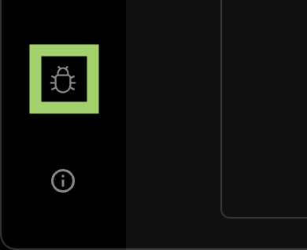

<!-- !!!!!!!!!! !!!!!!!!!!!!!!!!!!!!!!!!!!!!!!!!!!!!!!!!!!!!!!!!!!!!!!!! -->
<!--                   ATTENTION KURTOSIANS                              -->
<!--   Keep the latest on top, so users don't have to scroll to bottom   -->
<!-- !!!!!!!!!! !!!!!!!!!!!!!!!!!!!!!!!!!!!!!!!!!!!!!!!!!!!!!!!!!!!!!!!! -->

2024-02-26
==========

Enclave Builder UI
------------------

You can now build enclaves without writing code using the enclave builder UI:


The UI will automatically generate Starlark for you, which can be viewed with the "Preview" button.

To enable the enclave builder UI, go to the "About" icon in the bottom-left corner of the Kurtosis app and select "Enable experimental enclave builder interface". You'll then see an "Enclave Builder" button in the Enclave List screen.

Kurtosis Github Action
----------------------

You can now run Kurtosis inside your GH Actions CI using [our prebuilt Action](https://github.com/kurtosis-tech/kurtosis-github-action).

```yaml
- name: Kurtosis Tests
  uses: kurtosis-tech/kurtosis-github-action@v1
  with:
    path: 'github.com/my-org/my-kurtosis-package'  # Can also be the path to a 
                                                   # Kurtosis package in the repo
                                                   # For example:
                                                   # './path/to/kurtosis-package'
    args: './test-args.yaml'
```

This can be useful for integration & end-to-end tests, and can be paired with [ImageBuildSpec](https://docs.kurtosis.com/api-reference/starlark-reference/image-build-spec/) so that Kurtosis will both build the image and instantiate the environment.

Human-friendly plan steps
-------------------------

The default way `kurtosis run` describes plan steps is now human-friendly:


You can return to the previous way by adding `--verbosity brief` to your `kurtosis run` flags.

# Bugs & Feedback

You can now submit bugs from the Kurtosis app itself using the button in the bottom-left:



We're very interested in your feedback about the above features, so let us know what you think!
