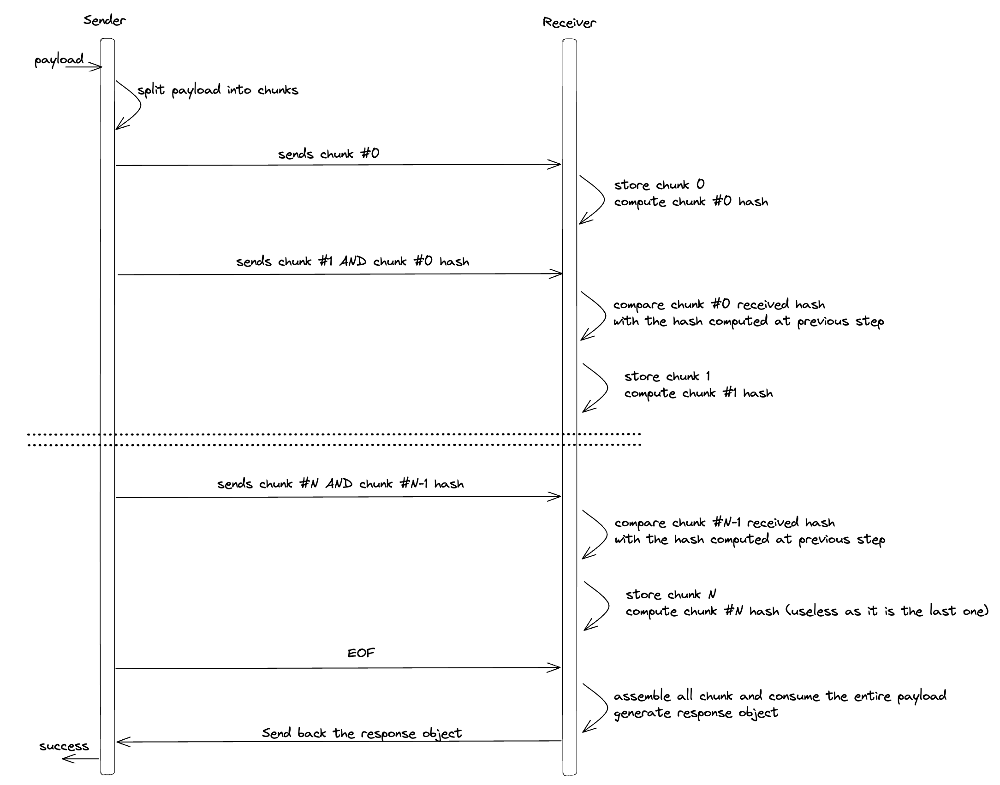
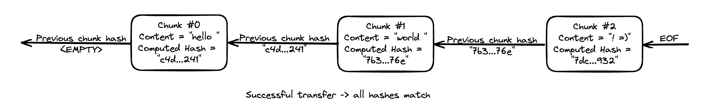
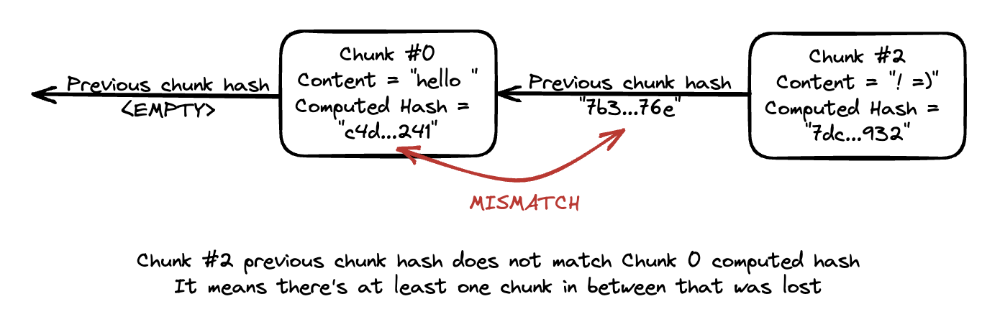

GRPC file streaming library
===========================

GRPC imposes a hard limit on request size of 4MB. This quickly becomes problematic when large payloads, typically files,
need to be sent between 2 GRPC services. To work around this limitation, it is advised to use GRPC streaming. However,
the logic of splitting the files into small chunks and streaming it to the other services doesn't come out of the box
with GRPC. This is what this package implements. 

This library handles this logic of for both GRPC `ServerStream` and `ClientStream` objects in a simple and safe way,
making sure the integrity of the file is preserved and failing as early as possible when an error occurs.

### Concepts of `sender` VS `receiver`
To better explain how this works, it's important to differentiate between the sender and the receiver. The sender is
the one sending a large file to the receiver. In other words, the sender pushes messages to the GRPC stream while
the receiver reads them.

Note that the concept of `sender` VS `receiver` is orthogonal to the concept of `client` VS `server`. Concrete examples:
in case of a file _upload_, the _client_ is the _sender_ and the _server_ the _receiver_. For a file _download_,
however, it's the opposite as the one pushing data through the stream is the _server_.

### How it works in practice
The library works the following way:
- The sender has the responsibility of splitting the initial payload into fixed-size chunks
- The sender pushes each chunk to the stream. Each chunk is sent alongside a hash of the _previous_ chunk, which was
computed when the previous chunk was processed. For the first chunk, the hash is empty
- The receiver pulls each chunk from the stream. Note that thanks to GRPC implementation of streaming, those push/pull 
happen _synchronously_. I.e. the sender will be blocked pushing the next chunk until the receiver has "consumed" it
- Each time the receiver receives a chunk, it computes its hash. This computed hash will be compared to the hash 
received with the _next_ chunk
- If the hash differs, it means at least one chunk was lost in between, and the receiver immediately cancels the 
transfer.

Here is a sequence diagram summarizing the above steps:

Illustration of a successful transfer:

Illustration of a failed transfer because the receiver was able to identify that one chunk is missing

